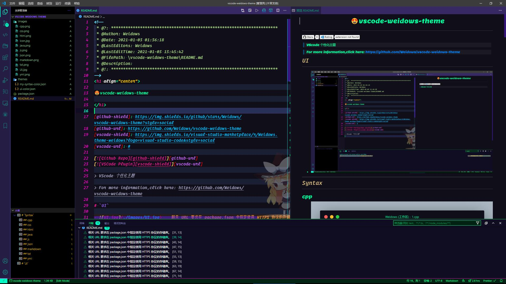
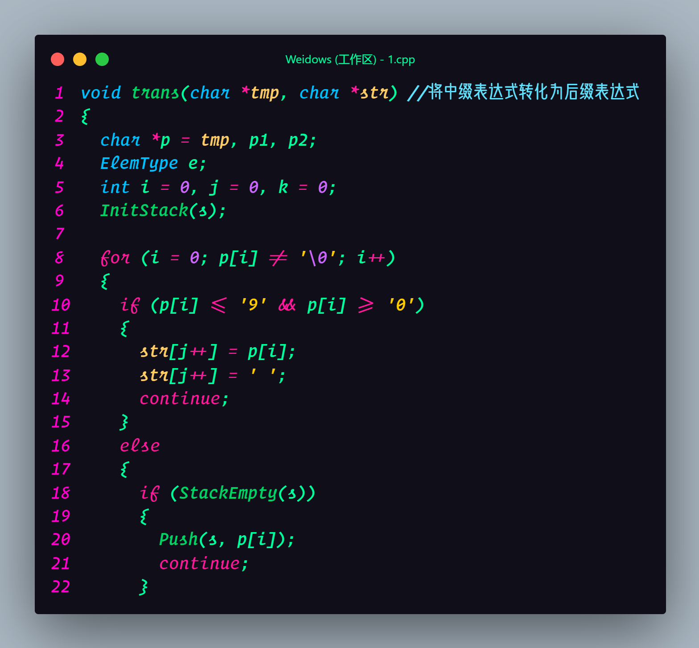
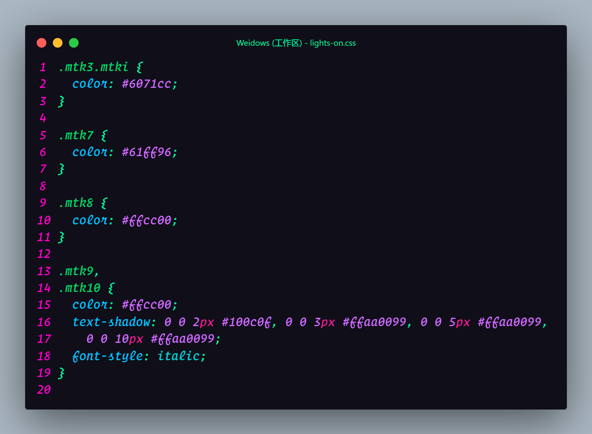
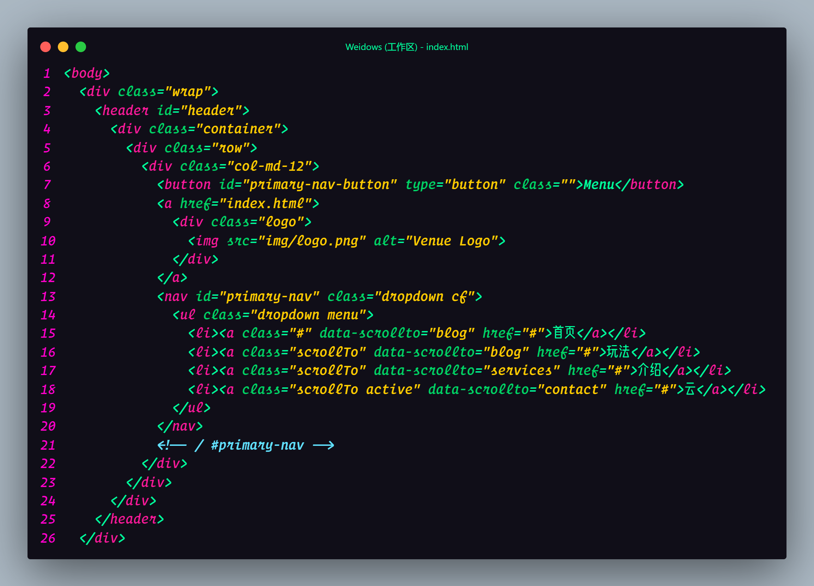
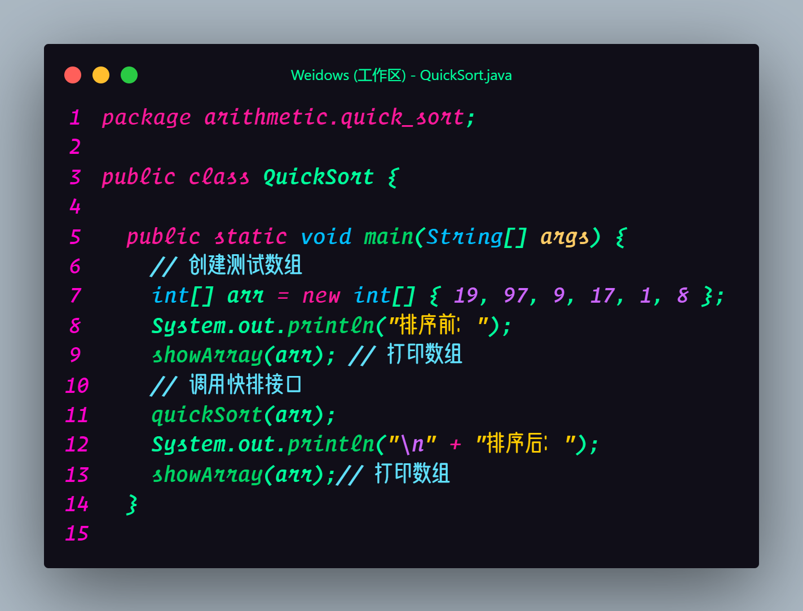
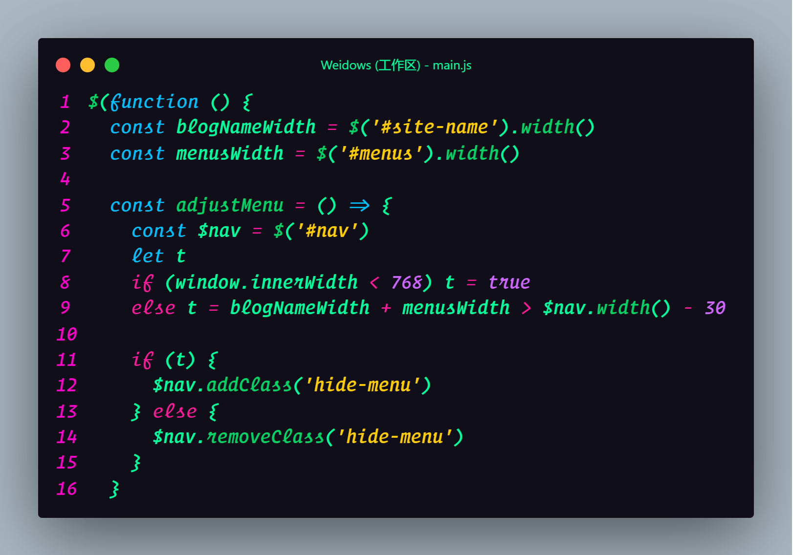
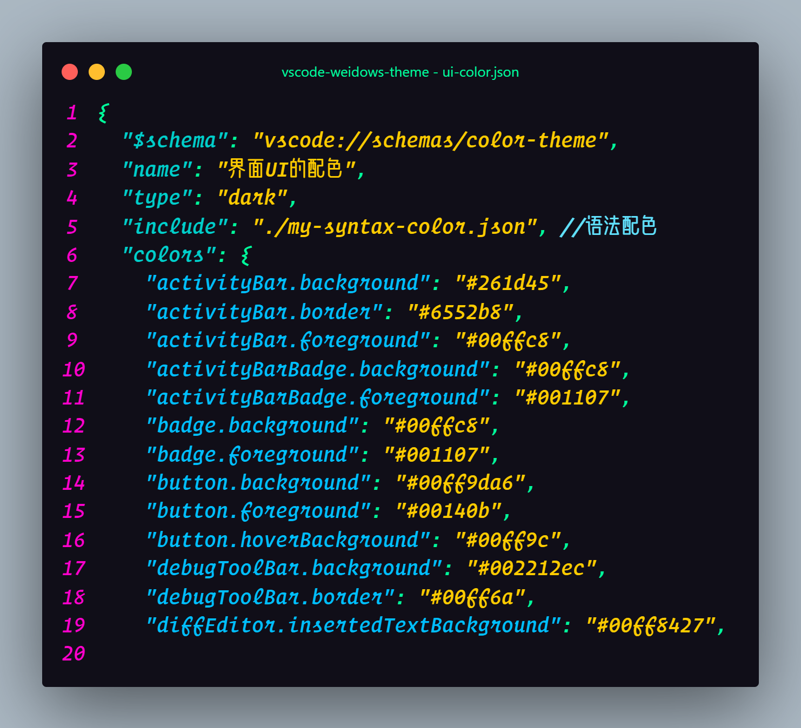
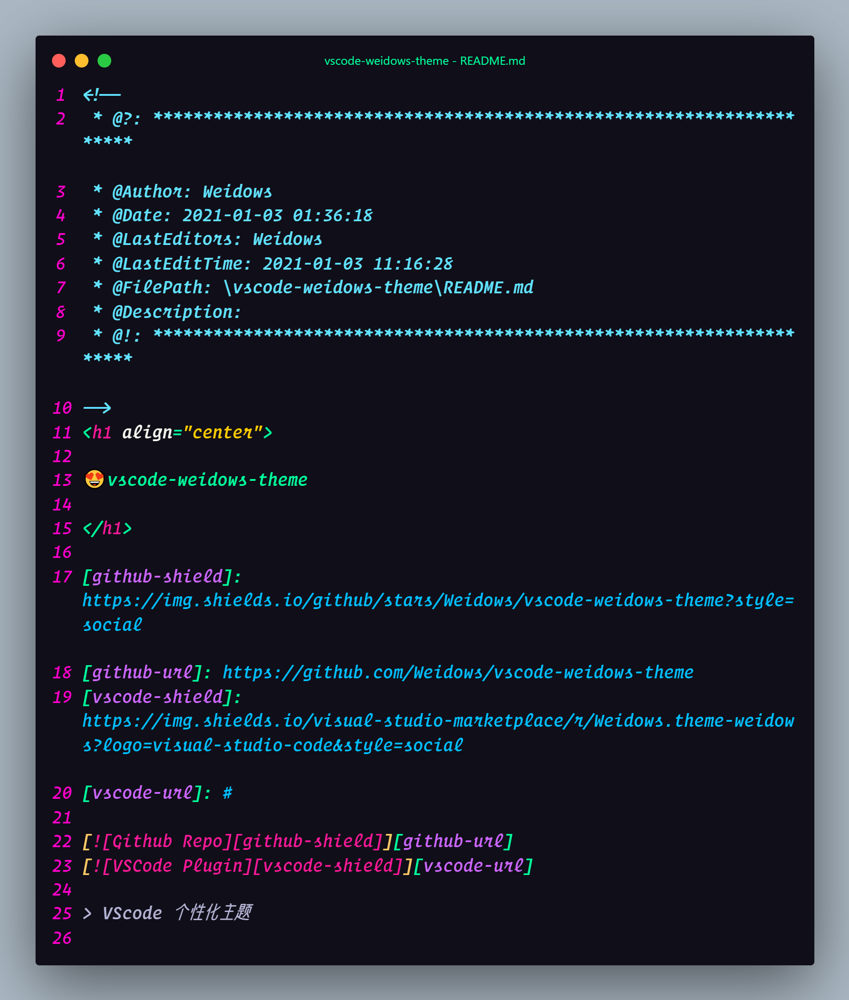
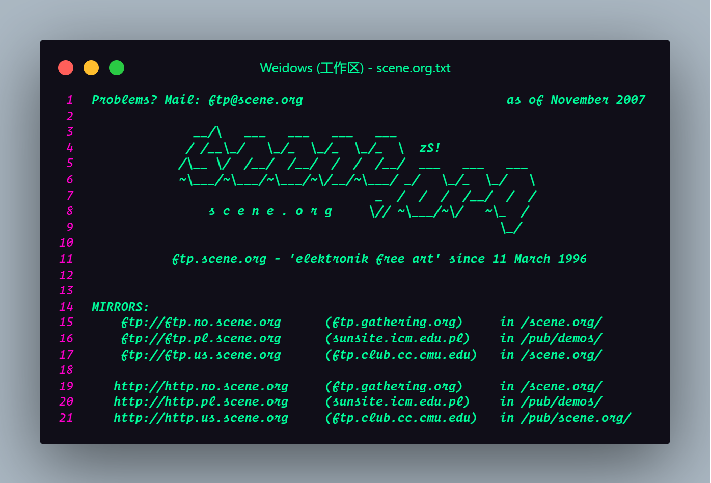
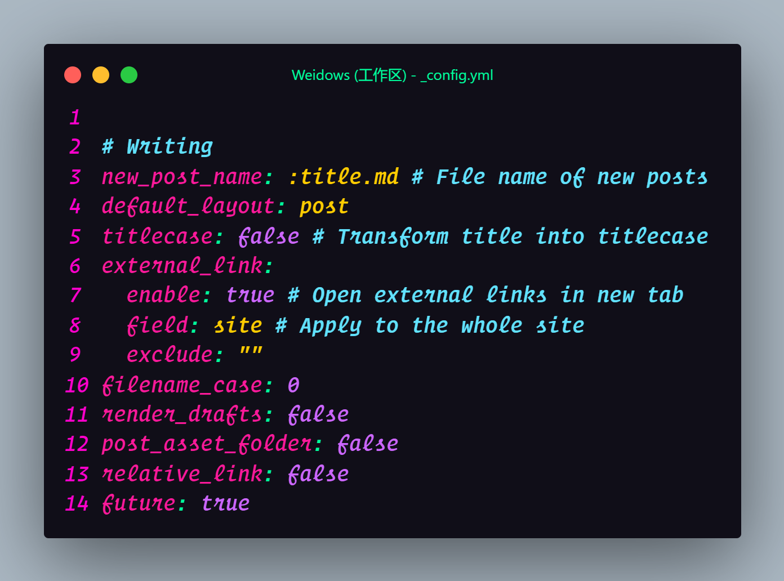

<!--
 * @?: *********************************************************************
 * @Author: Weidows
 * @Date: 2021-01-03 01:36:18
 * @LastEditors: Weidows
 * @LastEditTime: 2021-01-03 13:45:42
 * @FilePath: \vscode-weidows-theme\README.md
 * @Description:
 * @!: *********************************************************************
-->
<h1 align="center">

😍vscode-weidows-theme

</h1>

[github-shield]: https://img.shields.io/github/stars/Weidows/vscode-weidows-theme?style=social
[github-url]: https://github.com/Weidows/vscode-weidows-theme
[vscode-shield]: https://img.shields.io/visual-studio-marketplace/r/Weidows.theme-weidows?logo=visual-studio-code&style=social
[vscode-url]: #

[![Github Repo][github-shield]][github-url]
[![VSCode Plugin][vscode-shield]][vscode-url]

> VScode 个性化主题

> For more information,click here: https://github.com/Weidows/vscode-weidows-theme

# `UI`

- 

---

# `Syntax`

## cpp

- 

## css

- 

## html

- 

## java

- 

## js

- 

## json

- 

## markdown

- 

## txt

- 

## yml

- 
